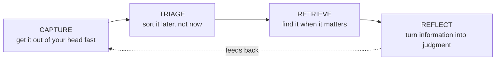
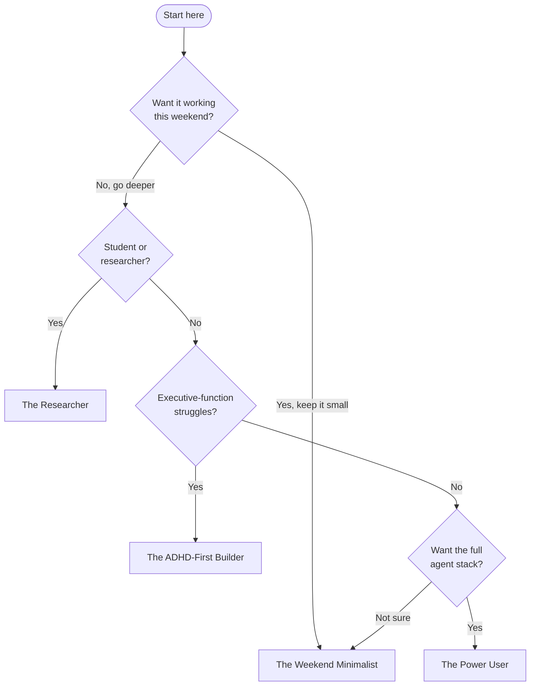

# The Guide — Start Here

**A complete, branching guide to building a personal second brain — and wiring an AI agent layer on top of it — starting from scratch.**

A second brain is a trusted external system for everything you'd otherwise try (and fail) to hold in your head. This guide gets you to a useful version in a weekend and a deep one over months. You don't read it front to back — you answer a few questions, pick a path, and skip the rest until you need it.

It's **tool-specific where it counts**: the worked example throughout is a real, in-daily-use stack — [Obsidian](https://obsidian.md) for notes, [Claude Code](https://claude.com/claude-code) as the agent layer, plus a handful of command-line tools — but the *principles* in each doc are portable to Logseq, Notion, or plain text files. Only the buttons change.

> [!NOTE]
> **Reading this inside your vault?** If you let `setup` install the guide, this same content lives in `guide/` — start at `MOC - Guide.md` there. **Reading on GitHub?** You're in the right place; the links below stay in this folder.

---

## The 60-second mental model

A second brain has four jobs. Every tool, folder, and automation exists to serve one of them:

If a tool doesn't make one of those four jobs *easier*, it's decoration. Cut it. → Full treatment in **[01 — Foundations & Philosophy](01-foundations-and-philosophy.md)**.

---

## Where do *you* start?

Answer these, then follow the matching **path**.

| # | Question | If yes / mostly… |
|---|---|---|
| 1 | Want a working notes system **this weekend**, automation later? | → **The Weekend Minimalist** |
| 2 | A **student or researcher** drowning in papers, courses, deadlines? | → **The Researcher** |
| 3 | Struggle with **avoidance, lost deadlines, executive-function fog** (ADHD-style)? | → **The ADHD-First Builder** |
| 4 | Want the **full agent-native stack** — CLI tools, voice capture, local models? | → **The Power User** |

> [!TIP]
> Not sure? Start as **The Weekend Minimalist**. Every other path is a superset of it — you can always layer more on.

---

## The paths

Each path is a **reading order**. Read the listed docs in sequence; ignore the rest until you want them.

### 🟢 The Weekend Minimalist
*A trusted capture-and-retrieve system, no automation yet.*
1. [01 — Foundations & Philosophy](01-foundations-and-philosophy.md)
2. [02 — Obsidian Vault Setup](02-obsidian-vault-setup.md) — the **3-folder minimum** branch
3. *Stop here for the weekend.* Later: [05 — Skills & Automation](05-skills-and-automation.md).

### 🔵 The Researcher
*Tame papers, courses, deadlines; retrieval that scales.*
1. [01 — Foundations & Philosophy](01-foundations-and-philosophy.md)
2. [02 — Obsidian Vault Setup](02-obsidian-vault-setup.md) — full taxonomy + MOCs
3. [03 — The Agent Layer (Claude Code)](03-the-agent-layer-claude-code.md)
4. [04 — Connectors & Tools (CLI → API → MCP)](04-connectors-and-tools.md)
5. [07 — Sync, Devices & Maintenance](07-sync-devices-and-maintenance.md)

### 🟣 The ADHD-First Builder
*The system carries the executive function you can't always supply.*
1. [01 — Foundations & Philosophy](01-foundations-and-philosophy.md) — the "externalized executive function" section
2. [06 — ADHD Empowerment System](06-adhd-empowerment-system.md) — **read this before the Obsidian doc.** It's the why.
3. [02 — Obsidian Vault Setup](02-obsidian-vault-setup.md) — just the 3-folder minimum
4. [03 — The Agent Layer (Claude Code)](03-the-agent-layer-claude-code.md)
5. [05 — Skills & Automation](05-skills-and-automation.md)
6. Going further: [advanced/adhd-patterns.md](advanced/adhd-patterns.md)

### 🔴 The Power User / Tinkerer
*The whole agent-native operating system.* Read **everything**, 01 → 08, then the `advanced/` layer. Pay special attention to:
- [04 — Connectors & Tools (CLI → API → MCP)](04-connectors-and-tools.md) — the load-bearing doctrine
- [07 — Sync, Devices & Maintenance](07-sync-devices-and-maintenance.md) — the canonical-device pattern + self-audit
- [08 — Going Further (Advanced)](08-going-further-advanced.md) — local LLMs, mobile control, the CLI factory
- [advanced/typed-memory.md](advanced/typed-memory.md) · [advanced/mcp-wiring.md](advanced/mcp-wiring.md) · [advanced/agent-system.md](advanced/agent-system.md)

### Already have a vault?
Don't start from scratch — see **[Augmenting an existing vault](augmenting-an-existing-vault.md)** (Windows + macOS).

---

## Full index

| Doc | What it gives you |
|---|---|
| [01 — Foundations & Philosophy](01-foundations-and-philosophy.md) | Why second brains work; the four jobs; the three-layer voice model |
| [02 — Obsidian Vault Setup](02-obsidian-vault-setup.md) | Install, folder taxonomy, frontmatter, MOCs, plugins, Notebook Navigator, periodic notes |
| [03 — The Agent Layer (Claude Code)](03-the-agent-layer-claude-code.md) | Install, the dual-CLAUDE.md pattern, settings, memory, context discipline |
| [04 — Connectors & Tools (CLI → API → MCP)](04-connectors-and-tools.md) | The integration doctrine + the CLI toolbelt |
| [05 — Skills & Automation](05-skills-and-automation.md) | Skills, slash commands, authoring your own, hooks, scheduling |
| [06 — ADHD Empowerment System](06-adhd-empowerment-system.md) | Executive-function scaffolding patterns |
| [07 — Sync, Devices & Maintenance](07-sync-devices-and-maintenance.md) | Multi-device parity, drift audits, backup, hygiene |
| [08 — Going Further (Advanced)](08-going-further-advanced.md) | Local LLMs, multi-provider, mobile, knowledge graph, CLI factory |
| [Augmenting an existing vault](augmenting-an-existing-vault.md) | Add this stack to a vault you already have, safely |
| [advanced/typed-memory.md](advanced/typed-memory.md) | A typed, file-based memory layer for your agent |
| [advanced/mcp-wiring.md](advanced/mcp-wiring.md) | Optional connectors (calendar, mail) — costs and trade-offs |
| [advanced/agent-system.md](advanced/agent-system.md) | Multi-agent routing patterns |
| [advanced/adhd-patterns.md](advanced/adhd-patterns.md) | Deeper executive-function scaffolds |

---

## Glossary

<b>Terms used throughout (click to expand)</b>

- **Second brain** — a trusted external system that holds what your biological memory shouldn't have to.
- **Vault** — Obsidian's name for a folder of Markdown files that *is* your knowledge base. Plain files, no lock-in.
- **MOC (Map of Content)** — a hub note that links out to related notes; a hand-curated index.
- **Frontmatter / properties** — the `---`-fenced YAML at the top of a note holding structured metadata (tags, dates, status).
- **Agent layer** — an AI (here, Claude Code) that can read, write, and act on your vault and connected services.
- **CLAUDE.md** — the instruction file that tells the agent who you are and how to behave.
- **Skill** — a reusable, packaged workflow the agent can invoke (often via a `/slash-command`).
- **MCP (Model Context Protocol)** — a standard for connecting an agent to external services.
- **CLI** — a command-line tool. The *preferred* way to connect an agent to a service (cheaper and more reliable than MCP).
- **Capture-fast-sort-slow** — drop everything into one inbox instantly; organize on your own schedule, never at capture time.
- **Three-layer voice model** — keeping *operational* notes (AI-assisted), *journal* (your raw voice, never AI-edited), and *reflection* (curated) in separate layers so authorship is never ambiguous.

---

*This guide began as the standalone [second-brain-onboarding](https://github.com/Noegnesis/second-brain-onboarding) repo and continues to evolve here.*
