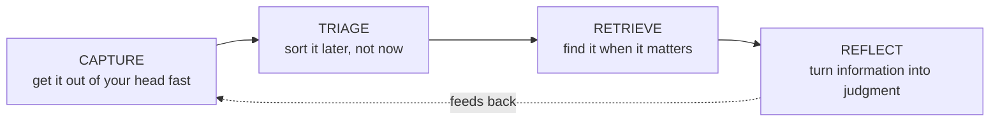
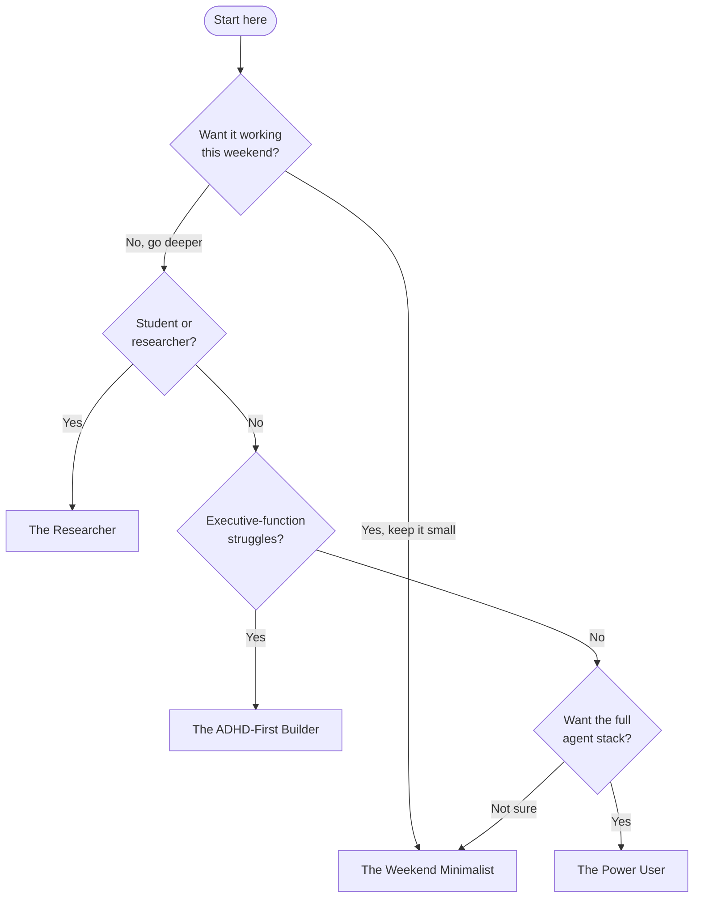

# Repo Convergence Implementation Plan

> **For agentic workers:** REQUIRED SUB-SKILL: Use superpowers:subagent-driven-development (recommended) or superpowers:executing-plans to implement this plan task-by-task. Steps use checkbox (`- [ ]`) syntax for tracking.

**Goal:** Absorb second-brain-onboarding (SBO) into noesis-starter: guide front door at `docs/README.md`, restored GitHub alerts in the 8 core docs, a setup step that installs the guide inside the vault it creates, and SBO archived behind a pointer README.

**Architecture:** Single GitHub-flavored doc source (`docs/`) serves both GitHub and Obsidian (GitHub's 5 alert types are valid Obsidian callouts; Obsidian resolves relative md links and renders Mermaid). The vault copy (`<vault>/guide/`) is a generated artifact of setup, never hand-edited. SBO freezes at a pointer.

**Tech Stack:** Bash (setup.sh, tests — must stay portable to macOS bash 3.2 + Git Bash), PowerShell 5.1 (setup.ps1), GitHub-flavored Markdown, `gh` CLI for the archive step.

**Spec:** `specs/2026-06-06-repo-convergence-design.md` (this repo). All work happens in the canonical clone at `~\Documents\GitHub\noesis-starter` (the owner keeps GitHub projects under `Documents\GitHub\`). Commits go directly to `master` (repo convention — no feature branches), but **nothing is pushed until the final task's user checkpoint**.

**Reference clone (needed by Tasks 4 and 8):**

```bash
git clone https://github.com/Noegnesis/second-brain-onboarding.git /tmp/sbo-ref
git -C /tmp/sbo-ref checkout 026fdbd
```

(On Windows Git Bash, `/tmp` works inside the Git Bash environment. From PowerShell use `$env:TEMP\sbo-ref` instead.)

---

### Task 1: Tests for the guide front door (`docs/README.md`)

**Files:**
- Modify: `tests/test_docs.sh`

- [ ] **Step 1: Add failing assertions to `tests/test_docs.sh`**

Append before the `finish` line:

```bash
# --- guide front door -------------------------------------------------------
assert_file_exists "$ROOT/docs/README.md" "guide front door docs/README.md exists"
front="$(cat "$ROOT/docs/README.md" 2>/dev/null || true)"
assert_contains "$front" "Weekend Minimalist" "front door has the Weekend Minimalist path"
assert_contains "$front" "ADHD-First Builder" "front door has the ADHD-First path"
assert_contains "$front" "advanced/typed-memory.md" "front door indexes the advanced docs"
assert_contains "$front" "augmenting-an-existing-vault.md" "front door indexes the augment guide"
assert_contains "$front" "second-brain-onboarding" "front door carries provenance line"
```

- [ ] **Step 2: Run to verify failure**

Run: `bash tests/test_docs.sh`
Expected: FAIL — `guide front door docs/README.md exists (no file: .../docs/README.md)` plus 5 more fails.

- [ ] **Step 3: Commit the failing test (red)**

```bash
git add tests/test_docs.sh
git commit -m "test: assert guide front door docs/README.md exists with paths + index"
```

---

### Task 2: Create `docs/README.md`

**Files:**
- Create: `docs/README.md`

- [ ] **Step 1: Create `docs/README.md` with exactly this content**

````markdown
# The Guide — Start Here

**A complete, branching guide to building a personal second brain — and wiring an AI agent layer on top of it — starting from scratch.**

A second brain is a trusted external system for everything you'd otherwise try (and fail) to hold in your head. This guide gets you to a useful version in a weekend and a deep one over months. You don't read it front to back — you answer a few questions, pick a path, and skip the rest until you need it.

It's **tool-specific where it counts**: the worked example throughout is a real, in-daily-use stack — [Obsidian](https://obsidian.md) for notes, [Claude Code](https://claude.com/claude-code) as the agent layer, plus a handful of command-line tools — but the *principles* in each doc are portable to Logseq, Notion, or plain text files. Only the buttons change.

> [!NOTE]
> **Reading this inside your vault?** If you let `setup` install the guide, this same content lives in `guide/` — start at `MOC - Guide.md` there. **Reading on GitHub?** You're in the right place; the links below stay in this folder.

---

## The 60-second mental model

A second brain has four jobs. Every tool, folder, and automation exists to serve one of them:



If a tool doesn't make one of those four jobs *easier*, it's decoration. Cut it. → Full treatment in **[01 — Foundations & Philosophy](01-foundations-and-philosophy.md)**.

---

## Where do *you* start?

Answer these, then follow the matching **path**.

| # | Question | If yes / mostly… |
|---|---|---|
| 1 | Want a working notes system **this weekend**, automation later? | → **The Weekend Minimalist** |
| 2 | A **student or researcher** drowning in papers, courses, deadlines? | → **The Researcher** |
| 3 | Struggle with **avoidance, lost deadlines, executive-function fog** (ADHD-style)? | → **The ADHD-First Builder** |
| 4 | Want the **full agent-native stack** — CLI tools, voice capture, local models? | → **The Power User** |



> [!TIP]
> Not sure? Start as **The Weekend Minimalist**. Every other path is a superset of it — you can always layer more on.

---

## The paths

Each path is a **reading order**. Read the listed docs in sequence; ignore the rest until you want them.

### 🟢 The Weekend Minimalist
*A trusted capture-and-retrieve system, no automation yet.*
1. [01 — Foundations & Philosophy](01-foundations-and-philosophy.md)
2. [02 — Obsidian Vault Setup](02-obsidian-vault-setup.md) — the **3-folder minimum** branch
3. *Stop here for the weekend.* Later: [05 — Skills & Automation](05-skills-and-automation.md).

### 🔵 The Researcher
*Tame papers, courses, deadlines; retrieval that scales.*
1. [01 — Foundations & Philosophy](01-foundations-and-philosophy.md)
2. [02 — Obsidian Vault Setup](02-obsidian-vault-setup.md) — full taxonomy + MOCs
3. [03 — The Agent Layer (Claude Code)](03-the-agent-layer-claude-code.md)
4. [04 — Connectors & Tools (CLI → API → MCP)](04-connectors-and-tools.md)
5. [07 — Sync, Devices & Maintenance](07-sync-devices-and-maintenance.md)

### 🟣 The ADHD-First Builder
*The system carries the executive function you can't always supply.*
1. [01 — Foundations & Philosophy](01-foundations-and-philosophy.md) — the "externalized executive function" section
2. [06 — ADHD Empowerment System](06-adhd-empowerment-system.md) — **read this before the Obsidian doc.** It's the why.
3. [02 — Obsidian Vault Setup](02-obsidian-vault-setup.md) — just the 3-folder minimum
4. [03 — The Agent Layer (Claude Code)](03-the-agent-layer-claude-code.md)
5. [05 — Skills & Automation](05-skills-and-automation.md)
6. Going further: [advanced/adhd-patterns.md](advanced/adhd-patterns.md)

### 🔴 The Power User / Tinkerer
*The whole agent-native operating system.* Read **everything**, 01 → 08, then the `advanced/` layer. Pay special attention to:
- [04 — Connectors & Tools (CLI → API → MCP)](04-connectors-and-tools.md) — the load-bearing doctrine
- [07 — Sync, Devices & Maintenance](07-sync-devices-and-maintenance.md) — the canonical-device pattern + self-audit
- [08 — Going Further (Advanced)](08-going-further-advanced.md) — local LLMs, mobile control, the CLI factory
- [advanced/typed-memory.md](advanced/typed-memory.md) · [advanced/mcp-wiring.md](advanced/mcp-wiring.md) · [advanced/agent-system.md](advanced/agent-system.md)

### Already have a vault?
Don't start from scratch — see **[Augmenting an existing vault](augmenting-an-existing-vault.md)** (Windows + macOS).

---

## Full index

| Doc | What it gives you |
|---|---|
| [01 — Foundations & Philosophy](01-foundations-and-philosophy.md) | Why second brains work; the four jobs; the three-layer voice model |
| [02 — Obsidian Vault Setup](02-obsidian-vault-setup.md) | Install, folder taxonomy, frontmatter, MOCs, plugins, Notebook Navigator, periodic notes |
| [03 — The Agent Layer (Claude Code)](03-the-agent-layer-claude-code.md) | Install, the dual-CLAUDE.md pattern, settings, memory, context discipline |
| [04 — Connectors & Tools (CLI → API → MCP)](04-connectors-and-tools.md) | The integration doctrine + the CLI toolbelt |
| [05 — Skills & Automation](05-skills-and-automation.md) | Skills, slash commands, authoring your own, hooks, scheduling |
| [06 — ADHD Empowerment System](06-adhd-empowerment-system.md) | Executive-function scaffolding patterns |
| [07 — Sync, Devices & Maintenance](07-sync-devices-and-maintenance.md) | Multi-device parity, drift audits, backup, hygiene |
| [08 — Going Further (Advanced)](08-going-further-advanced.md) | Local LLMs, multi-provider, mobile, knowledge graph, CLI factory |
| [Augmenting an existing vault](augmenting-an-existing-vault.md) | Add this stack to a vault you already have, safely |
| [advanced/typed-memory.md](advanced/typed-memory.md) | A typed, file-based memory layer for your agent |
| [advanced/mcp-wiring.md](advanced/mcp-wiring.md) | Optional connectors (calendar, mail) — costs and trade-offs |
| [advanced/agent-system.md](advanced/agent-system.md) | Multi-agent routing patterns |
| [advanced/adhd-patterns.md](advanced/adhd-patterns.md) | Deeper executive-function scaffolds |

---

## Glossary

<details>
<summary><b>Terms used throughout (click to expand)</b></summary>

- **Second brain** — a trusted external system that holds what your biological memory shouldn't have to.
- **Vault** — Obsidian's name for a folder of Markdown files that *is* your knowledge base. Plain files, no lock-in.
- **MOC (Map of Content)** — a hub note that links out to related notes; a hand-curated index.
- **Frontmatter / properties** — the `---`-fenced YAML at the top of a note holding structured metadata (tags, dates, status).
- **Agent layer** — an AI (here, Claude Code) that can read, write, and act on your vault and connected services.
- **CLAUDE.md** — the instruction file that tells the agent who you are and how to behave.
- **Skill** — a reusable, packaged workflow the agent can invoke (often via a `/slash-command`).
- **MCP (Model Context Protocol)** — a standard for connecting an agent to external services.
- **CLI** — a command-line tool. The *preferred* way to connect an agent to a service (cheaper and more reliable than MCP).
- **Capture-fast-sort-slow** — drop everything into one inbox instantly; organize on your own schedule, never at capture time.
- **Three-layer voice model** — keeping *operational* notes (AI-assisted), *journal* (your raw voice, never AI-edited), and *reflection* (curated) in separate layers so authorship is never ambiguous.

</details>

---

*This guide began as the standalone [second-brain-onboarding](https://github.com/Noegnesis/second-brain-onboarding) repo and continues to evolve here.*
````

- [ ] **Step 2: Run tests to verify pass**

Run: `bash tests/test_docs.sh`
Expected: PASS — all assertions including the 6 new ones.

- [ ] **Step 3: Commit**

```bash
git add docs/README.md
git commit -m "docs: add guide front door (persona paths, router, index, glossary)"
```

---

### Task 3: Top-level README links to the guide

**Files:**
- Modify: `tests/test_readme.sh`
- Modify: `README.md` (the "Going deeper" section, currently lines 40-42)

- [ ] **Step 1: Add failing assertion to `tests/test_readme.sh`** (before `finish`)

```bash
assert_contains "$body" "docs/README.md" "README routes readers to the guide front door"
```

- [ ] **Step 2: Run to verify failure**

Run: `bash tests/test_readme.sh`
Expected: FAIL — `README routes readers to the guide front door (missing: docs/README.md)`

- [ ] **Step 3: Replace the "Going deeper" section in `README.md`**

Old:

```markdown
## Going deeper

See `docs/` for the full guide, and `docs/advanced/` for optional layers (typed memory, MCP wiring, agent system, ADHD-friendly patterns).
```

New:

```markdown
## Going deeper

**📚 The full guide — pick your path → [docs/README.md](docs/README.md)**

Four reading paths (Weekend Minimalist · Researcher · ADHD-First Builder · Power User), plus `docs/advanced/` for optional layers (typed memory, MCP wiring, agent system, ADHD-friendly patterns). If you let setup install it, the same guide lives inside your vault under `guide/`.
```

- [ ] **Step 4: Run tests to verify pass**

Run: `bash tests/test_readme.sh`
Expected: PASS (4 assertions: mac-before-win, Kashef, beta, front door).

- [ ] **Step 5: Commit**

```bash
git add README.md tests/test_readme.sh
git commit -m "docs: route README readers to the guide front door"
```

---

### Task 4: Alert lint + link resolution + restoration baseline tests

**Files:**
- Modify: `tests/test_docs.sh`

- [ ] **Step 1: Append to `tests/test_docs.sh`** (before `finish`)

```bash
# --- every relative .md link in docs/ resolves -------------------------------
broken=""
for f in "$ROOT/docs"/*.md "$ROOT/docs/advanced"/*.md "$ROOT/docs/handoff"/*.md; do
  [ -f "$f" ] || continue
  dir="$(dirname "$f")"
  for link in $(grep -oE '\]\([^)#]+\.md' "$f" | sed 's/^](//'); do
    case "$link" in http*) continue;; esac
    [ -f "$dir/$link" ] || broken="$broken $(basename "$f")->$link"
  done
done
if [ -z "$broken" ]; then pass "all relative doc links resolve"; else fail "broken doc links:$broken"; fi

# --- alert markers outside code fences must be GitHub-valid types ------------
violations="$(awk '
  /^[[:space:]]*(```|~~~)/ { fence = !fence; next }
  !fence && /^> \[!/ && $0 !~ /^> \[!(NOTE|TIP|IMPORTANT|WARNING|CAUTION)\]/ { print FILENAME }
' "$ROOT/docs"/*.md "$ROOT/docs/advanced"/*.md)"
if [ -z "$violations" ]; then pass "alert markers are GitHub-valid types"; else fail "invalid alert markers in: $violations"; fi

# --- restoration baseline: out-of-fence alert counts per core doc ------------
# (>= so future additions don't break; < means the fork dropped callouts again)
check_alert_floor() {
  n="$(awk '
    /^[[:space:]]*(```|~~~)/ { fence = !fence; next }
    !fence && /^> \[!(NOTE|TIP|IMPORTANT|WARNING|CAUTION)\]/ { c++ }
    END { print c+0 }
  ' "$ROOT/docs/$1")"
  if [ "$n" -ge "$2" ]; then pass "docs/$1 has >= $2 alerts ($n)"; else fail "docs/$1 alert count $n < baseline $2"; fi
}
check_alert_floor 01-foundations-and-philosophy.md 3
check_alert_floor 02-obsidian-vault-setup.md 3
check_alert_floor 03-the-agent-layer-claude-code.md 4
check_alert_floor 04-connectors-and-tools.md 3
check_alert_floor 05-skills-and-automation.md 3
check_alert_floor 06-adhd-empowerment-system.md 4
check_alert_floor 07-sync-devices-and-maintenance.md 3
check_alert_floor 08-going-further-advanced.md 3
```

- [ ] **Step 2: Run to verify the expected failures**

Run: `bash tests/test_docs.sh`
Expected: link check PASS (verify — if it FAILS, list the broken links and fix them as part of Task 5), alert-lint PASS (the only non-GitHub markers, `[!raw]`/`[!ai]` in doc 02, are inside code fences and skipped), all 8 `check_alert_floor` FAIL (current out-of-fence counts are 0 everywhere).

- [ ] **Step 3: Commit the failing test (red)**

```bash
git add tests/test_docs.sh
git commit -m "test: doc link resolution + alert lint + restoration baselines"
```

---

### Task 5: Restore the dropped alerts in the 8 core docs

**Files:**
- Modify: `docs/01-foundations-and-philosophy.md` … `docs/08-going-further-advanced.md` (all 8)
- Reference: `/tmp/sbo-ref/docs/*.md` at SHA `026fdbd` (clone command in the header)

**Background:** When the docs were forked from SBO, every out-of-fence `> [!TYPE]` marker line was deleted, leaving the blockquote below it as a plain `> **Bold title**` quote. All 26 anchors still exist verbatim in our docs (verified 2026-06-06). Restoration = re-insert the marker line above each surviving anchor. **No prose changes.**

- [ ] **Step 1: For each of the 8 docs, diff against the reference and re-insert markers**

For each file `NN-*.md`:

```bash
diff /tmp/sbo-ref/docs/<file> docs/<file> | grep '^< > \[!'
```

Each reported line like `< > [!TIP]` was immediately above an anchor blockquote line (e.g. `> **Branch here**`). Find that same anchor in our copy and insert the marker line directly above it, so:

```markdown
> **Branch here**
```

becomes:

```markdown
> [!TIP]
> **Branch here**
```

The full inventory to restore (type → anchor title):

| Doc | Markers |
|---|---|
| 01 | TIP→"The litmus test for any tool or habit", WARNING→"Why this matters more than it sounds", TIP→"Don't pick one orthodoxy and obey it" |
| 02 | TIP→"Branch here", WARNING→"The one rule that protects everything", TIP→"Plugin discipline" |
| 03 | TIP→"One agent, one vault", WARNING→"Don't duplicate everything", TIP→"What else lives in settings.json", TIP→"What belongs in memory vs the vault" |
| 04 | WARNING→"The default everyone gets wrong", TIP→"\"Hard-code the one endpoint\"", TIP→"Wrap your most-used CLI calls in skills" |
| 05 | TIP→"Build the daily loop first", WARNING→"DRY your skills", TIP→"Memory/preferences can't enforce behavior" |
| 06 | TIP→"Design principle for this whole doc", IMPORTANT→"Put this in your CLAUDE.md", TIP→"Keep it kind", TIP→"The forgiveness test" |
| 07 | WARNING→"The mistake almost everyone makes", TIP→"Decide before you create the vault", TIP→"The state doc is the secret" |
| 08 | WARNING→"Read this first", TIP→"This is the endgame of the connector doc", TIP→"One at a time" |

Do **not** add markers to blockquotes that exist only in our docs (e.g. the "Three NN quirks" quote in doc 02) — restoration only.

- [ ] **Step 2: Run tests to verify pass**

Run: `bash tests/test_docs.sh`
Expected: PASS — all 8 `check_alert_floor` baselines met, lint still clean.

- [ ] **Step 3: Spot-check rendering**

Run: `grep -n '^> \[!' docs/02-obsidian-vault-setup.md`
Expected: `[!TIP]`/`[!WARNING]` lines each immediately followed by a `> **…**` line (plus the two in-fence `[!raw]`/`[!ai]` examples unchanged).

- [ ] **Step 4: Commit**

```bash
git add docs/
git commit -m "docs: restore GitHub alert markers dropped in the SBO fork (26 callouts)"
```

---

### Task 6: Vault-side MOC source

**Files:**
- Modify: `tests/test_vault_template.sh`
- Create: `vault-template/guide/MOC - Guide.md`

- [ ] **Step 1: Add failing assertions to `tests/test_vault_template.sh`** (before `finish`)

```bash
moc="$ROOT/vault-template/guide/MOC - Guide.md"
assert_file_exists "$moc" "vault-side guide MOC exists"
mocbody="$(cat "$moc" 2>/dev/null || true)"
assert_contains "$mocbody" "Weekend Minimalist" "MOC has the persona paths"
assert_contains "$mocbody" "(01-foundations-and-philosophy.md)" "MOC links docs by relative md links"
```

- [ ] **Step 2: Run to verify failure**

Run: `bash tests/test_vault_template.sh`
Expected: FAIL ×3.

- [ ] **Step 3: Create `vault-template/guide/MOC - Guide.md` with exactly this content**

````markdown
---
title: The Guide — Start Here
type: moc
tags:
  - guide
  - second-brain
---

# The Guide — Start Here

> [!NOTE]
> This folder is your copy of the noesis-starter guide, installed by setup. It's a **generated artifact** — to update it, re-run setup (or re-copy `docs/` from the repo). Edits made here will be overwritten.

A second brain has four jobs. Every tool, folder, and automation in this guide exists to serve one of them:


If a tool doesn't make one of those four jobs *easier*, it's decoration. Cut it. → Full treatment in [01 — Foundations & Philosophy](01-foundations-and-philosophy.md).

---

## Where do *you* start?


> [!TIP]
> Not sure? Start as **The Weekend Minimalist**. Every other path is a superset of it.

## The paths

### 🟢 The Weekend Minimalist
1. [01 — Foundations & Philosophy](01-foundations-and-philosophy.md)
2. [02 — Obsidian Vault Setup](02-obsidian-vault-setup.md) — the **3-folder minimum** branch
3. *Stop here for the weekend.* Later: [05 — Skills & Automation](05-skills-and-automation.md).

### 🔵 The Researcher
1. [01 — Foundations & Philosophy](01-foundations-and-philosophy.md)
2. [02 — Obsidian Vault Setup](02-obsidian-vault-setup.md) — full taxonomy + MOCs
3. [03 — The Agent Layer (Claude Code)](03-the-agent-layer-claude-code.md)
4. [04 — Connectors & Tools (CLI → API → MCP)](04-connectors-and-tools.md)
5. [07 — Sync, Devices & Maintenance](07-sync-devices-and-maintenance.md)

### 🟣 The ADHD-First Builder
1. [01 — Foundations & Philosophy](01-foundations-and-philosophy.md) — the "externalized executive function" section
2. [06 — ADHD Empowerment System](06-adhd-empowerment-system.md) — **read this before the Obsidian doc.**
3. [02 — Obsidian Vault Setup](02-obsidian-vault-setup.md) — just the 3-folder minimum
4. [03 — The Agent Layer (Claude Code)](03-the-agent-layer-claude-code.md)
5. [05 — Skills & Automation](05-skills-and-automation.md)
6. Going further: [ADHD patterns](advanced/adhd-patterns.md)

### 🔴 The Power User / Tinkerer
Read **everything**, 01 → 08, then the advanced layer:
[Typed memory](advanced/typed-memory.md) · [MCP wiring](advanced/mcp-wiring.md) · [Agent system](advanced/agent-system.md) · [ADHD patterns](advanced/adhd-patterns.md)

### Already have a vault?
[Augmenting an existing vault](augmenting-an-existing-vault.md)

---

## Full index

| Doc | What it gives you |
|---|---|
| [01 — Foundations & Philosophy](01-foundations-and-philosophy.md) | Why second brains work; the four jobs; the three-layer voice model |
| [02 — Obsidian Vault Setup](02-obsidian-vault-setup.md) | Install, folder taxonomy, frontmatter, MOCs, plugins, periodic notes |
| [03 — The Agent Layer (Claude Code)](03-the-agent-layer-claude-code.md) | Install, the dual-CLAUDE.md pattern, settings, memory, context discipline |
| [04 — Connectors & Tools (CLI → API → MCP)](04-connectors-and-tools.md) | The integration doctrine + the CLI toolbelt |
| [05 — Skills & Automation](05-skills-and-automation.md) | Skills, slash commands, authoring your own, hooks, scheduling |
| [06 — ADHD Empowerment System](06-adhd-empowerment-system.md) | Executive-function scaffolding patterns |
| [07 — Sync, Devices & Maintenance](07-sync-devices-and-maintenance.md) | Multi-device parity, drift audits, backup, hygiene |
| [08 — Going Further (Advanced)](08-going-further-advanced.md) | Local LLMs, multi-provider, mobile, knowledge graph, CLI factory |

> [!NOTE]- Glossary (click to expand)
> - **Second brain** — a trusted external system that holds what your biological memory shouldn't have to.
> - **Vault** — Obsidian's name for a folder of Markdown files that *is* your knowledge base.
> - **MOC (Map of Content)** — a hub note that links out to related notes; a hand-curated index. (You're reading one.)
> - **Agent layer** — an AI (here, Claude Code) that can read, write, and act on your vault and connected services.
> - **CLAUDE.md** — the instruction file that tells the agent who you are and how to behave.
> - **Skill** — a reusable, packaged workflow the agent can invoke (often via a `/slash-command`).
> - **MCP (Model Context Protocol)** — a standard for connecting an agent to external services.
> - **CLI** — a command-line tool. The *preferred* way to connect an agent to a service.
> - **Capture-fast-sort-slow** — drop everything into one inbox instantly; organize on your own schedule.
> - **Three-layer voice model** — *operational* (AI-assisted) / *journal* (raw, never AI-edited) / *reflection* (curated) kept separate so authorship is never ambiguous.
````

- [ ] **Step 4: Run tests to verify pass**

Run: `bash tests/test_vault_template.sh`
Expected: PASS ×6 (3 existing + 3 new).

- [ ] **Step 5: Commit**

```bash
git add vault-template/guide/ tests/test_vault_template.sh
git commit -m "feat: vault-side guide MOC (source for the setup guide-install step)"
```

---

### Task 7: Static test for the setup guide step

**Files:**
- Create: `tests/test_setup_guide.sh`

- [ ] **Step 1: Create `tests/test_setup_guide.sh`** (style mirrors `test_handoff.sh` — static greps; the suite never executes setup; Task 11 covers live execution)

```bash
#!/usr/bin/env bash
set -u
HERE="$(cd "$(dirname "$0")" && pwd)"; ROOT="$(cd "$HERE/.." && pwd)"
. "$HERE/lib.sh"
sh_body="$(cat "$ROOT/setup.sh")"
ps_body="$(cat "$ROOT/setup.ps1")"
assert_contains "$sh_body" "Include the full guide in your vault?" "setup.sh prompts for the guide (default yes)"
assert_contains "$sh_body" '/guide/advanced' "setup.sh creates guide/advanced in the vault"
assert_contains "$sh_body" 'MOC - Guide.md' "setup.sh installs the MOC"
assert_not_contains "$sh_body" 'docs/handoff' "setup.sh never copies handoff docs into vaults"
assert_contains "$ps_body" "Include the full guide in your vault?" "setup.ps1 prompts for the guide (default yes)"
assert_contains "$ps_body" 'guide\advanced' "setup.ps1 creates guide\advanced in the vault"
assert_contains "$ps_body" 'MOC - Guide.md' "setup.ps1 installs the MOC"
assert_not_contains "$ps_body" 'docs\handoff' "setup.ps1 never copies handoff docs into vaults"
finish
```

(Delete the stray `for body_name…` line — it's shown here only to flag that lib.sh has no loop helper; the assertions above are the whole test.)

- [ ] **Step 2: Run to verify failure**

Run: `bash tests/test_setup_guide.sh`
Expected: FAIL on all `assert_contains` (the two `assert_not_contains` pass vacuously).

- [ ] **Step 3: Commit the failing test (red)**

```bash
git add tests/test_setup_guide.sh
git commit -m "test: static assertions for the setup guide-install step"
```

---

### Task 8: Guide-install step in `setup.sh`

**Files:**
- Modify: `setup.sh` — insert after the `process_files_with_gemini.py` safe_cp (line 275), before the global-skills block (line 277)

- [ ] **Step 1: Insert this block**

```bash
# ─── Guide in the vault (optional, default yes) ──────────────────────────────
echo ""
echo -e "  The full guide (8 docs + advanced topics) can live inside your vault"
echo -e "  ${DIM}as guide/ — read it in Obsidian, link it from your notes${RESET}"
read -rp "  Include the full guide in your vault? [Y/n]: " GUIDE_ANSWER
GUIDE_ANSWER="${GUIDE_ANSWER:-Y}"
if [[ "$GUIDE_ANSWER" =~ ^[Yy] ]]; then
  mkdir -p "$VAULT_PATH/guide/advanced"
  GUIDE_FAIL=false
  for f in "$SCRIPT_DIR"/docs/*.md; do
    base="$(basename "$f")"
    [ "$base" = "README.md" ] && continue   # README is the GitHub front door; MOC is the vault one
    cp "$f" "$VAULT_PATH/guide/$base" 2>/dev/null || GUIDE_FAIL=true
  done
  for f in "$SCRIPT_DIR"/docs/advanced/*.md; do
    cp "$f" "$VAULT_PATH/guide/advanced/$(basename "$f")" 2>/dev/null || GUIDE_FAIL=true
  done
  cp "$SCRIPT_DIR/vault-template/guide/MOC - Guide.md" "$VAULT_PATH/guide/MOC - Guide.md" 2>/dev/null || GUIDE_FAIL=true
  if [ "$GUIDE_FAIL" = true ]; then
    echo -e "  ${ORANGE}⚠${RESET}  Some guide files didn't copy. Finish manually with:"
    echo -e "     ${DIM}cp \"$SCRIPT_DIR\"/docs/[0-9]*.md \"$VAULT_PATH/guide/\"${RESET}"
  else
    echo -e "  ${GREEN}✓${RESET} Guide installed → $VAULT_PATH/guide/ (start at MOC - Guide.md)"
  fi
fi
```

Note: copying only `docs/*.md` (top level) plus `docs/advanced/*.md` explicitly means `docs/handoff/` is excluded by construction.

- [ ] **Step 2: Run static test**

Run: `bash tests/test_setup_guide.sh`
Expected: the 4 `setup.sh` assertions PASS; the 4 `setup.ps1` assertions still FAIL (Task 9 fixes those).

- [ ] **Step 3: Syntax-check**

Run: `bash -n setup.sh`
Expected: no output, exit 0.

- [ ] **Step 4: Commit**

```bash
git add setup.sh
git commit -m "feat(setup.sh): optionally install the guide into the vault (default yes)"
```

---

### Task 9: Guide-install step in `setup.ps1`

**Files:**
- Modify: `setup.ps1` — insert after the `$copyErrors` warning block (line 340), before the global-skills install (line 342)

- [ ] **Step 1: Insert this block**

```powershell
# Guide in the vault (optional, default yes)
Write-Host ""
Write-Host "  The full guide (8 docs + advanced topics) can live inside your vault"
Write-Host "  ${Dim}as guide\ -- read it in Obsidian, link it from your notes${Reset}"
$guideAnswer = Read-Host "  Include the full guide in your vault? [Y/n]"
if (-not $guideAnswer) { $guideAnswer = "Y" }
if ($guideAnswer -match '^[Yy]') {
    New-Item -ItemType Directory -Force -Path "$vaultPath\guide\advanced" | Out-Null
    $guideFail = $false
    foreach ($f in (Get-ChildItem "$scriptDir\docs" -Filter *.md -File -ErrorAction SilentlyContinue)) {
        if ($f.Name -eq "README.md") { continue }  # README is the GitHub front door; MOC is the vault one
        try { Copy-Item $f.FullName "$vaultPath\guide\$($f.Name)" -Force -ErrorAction Stop } catch { $guideFail = $true }
    }
    foreach ($f in (Get-ChildItem "$scriptDir\docs\advanced" -Filter *.md -File -ErrorAction SilentlyContinue)) {
        try { Copy-Item $f.FullName "$vaultPath\guide\advanced\$($f.Name)" -Force -ErrorAction Stop } catch { $guideFail = $true }
    }
    if (Test-Path "$scriptDir\vault-template\guide\MOC - Guide.md") {
        try { Copy-Item "$scriptDir\vault-template\guide\MOC - Guide.md" "$vaultPath\guide\MOC - Guide.md" -Force -ErrorAction Stop } catch { $guideFail = $true }
    } else { $guideFail = $true }
    if ($guideFail) {
        Write-Host "  ${Orange}WARNING${Reset}  Some guide files didn't copy. Finish manually:"
        Write-Host "        Copy-Item `"$scriptDir\docs\*.md`" `"$vaultPath\guide\`""
    } else {
        Write-Host "  ${Green}OK${Reset} Guide installed -> $vaultPath\guide\ (start at MOC - Guide.md)"
    }
}
```

- [ ] **Step 2: Run static test**

Run: `bash tests/test_setup_guide.sh`
Expected: all 8 assertions PASS.

- [ ] **Step 3: Syntax-check**

Run (PowerShell): `powershell -NoProfile -Command "[void][System.Management.Automation.Language.Parser]::ParseFile('setup.ps1', [ref]$null, [ref]$err); $err.Count"`
Expected: `0`

- [ ] **Step 4: Commit**

```bash
git add setup.ps1
git commit -m "feat(setup.ps1): optionally install the guide into the vault (default yes)"
```

---

### Task 10: CLAUDE.md template + README "What gets installed"

**Files:**
- Modify: `CLAUDE.md` (the repo-root template that setup copies into vaults)
- Modify: `README.md` ("What gets installed" + "How the vault is structured" sections)

- [ ] **Step 1: Add the guide line to the template's Vault Structure block**

In `CLAUDE.md`, change:

```
research/   ← Notes, synthesis, saved ideas
archive/    ← Completed work. Never delete, just archive.
```

to:

```
research/   ← Notes, synthesis, saved ideas
archive/    ← Completed work. Never delete, just archive.
guide/      ← The how-to guide (optional install). Start at MOC - Guide.md.
```

- [ ] **Step 2: Mirror in `README.md`'s vault-structure diagram** — after the `archive/` line add:

```
└── guide/           ← The full guide (optional). Start at MOC - Guide.md.
```

and in "What gets installed" change the sentence to mention the guide:

```markdown
Obsidian, Claude Code, Python deps (in an isolated venv), the core skills (`/vault-setup`, `/daily`, `/tldr`, `/file-intel`) both in this vault and globally, and (optionally) the full guide inside your vault as `guide/`.
```

- [ ] **Step 3: Run the full suite**

Run: `bash tests/run.sh`
Expected: exit 0, all files green.

- [ ] **Step 4: Commit**

```bash
git add CLAUDE.md README.md
git commit -m "docs: surface guide/ in the vault structure template + install summary"
```

---

### Task 11: Manual end-to-end verification on Omen (both platforms)

No file changes — verification only. **Do not skip.**

- [ ] **Step 1: Git Bash run into a throwaway vault**

In Git Bash: `bash setup.sh`, choose a temp vault path (e.g. `/tmp/guide-vault-test`), answer the guide prompt with Enter (default yes), skip API key / import / Kepano.

Expected: `guide/` exists in the vault with `01-…md` … `08-…md`, `augmenting-an-existing-vault.md`, `advanced/` (4 files), `MOC - Guide.md` — and **no** `README.md`, **no** `handoff/`.

- [ ] **Step 2: PowerShell run, opting OUT**

In PowerShell: `powershell -ExecutionPolicy Bypass -File setup.ps1`, temp vault path, answer `n` to the guide prompt.

Expected: vault created, **no** `guide/` folder, no errors.

- [ ] **Step 3: Obsidian spot-check**

Open the Step-1 vault in Obsidian; open `guide/MOC - Guide.md`.
Expected: callouts render (TIP/NOTE boxes), Mermaid diagrams render, clicking `01 — Foundations & Philosophy` opens the note, glossary callout is collapsed.

- [ ] **Step 4: Delete both throwaway vaults.** Record any deviations in this plan file under an `## Execution notes` heading.

---

### Task 12: SBO pointer README + archive — ⛔ USER CHECKPOINT FIRST

**Outward-facing: pushes to a public repo and archives it. Get explicit user confirmation before Step 2.**

**Files:**
- Create: `~\Documents\GitHub\second-brain-onboarding\README.md` (full replacement, in a fresh clone)

- [ ] **Step 1: Clone SBO to the GitHub folder and replace its README with exactly this**

```bash
git clone https://github.com/Noegnesis/second-brain-onboarding.git \
  ~/Documents/GitHub/second-brain-onboarding
```

New `README.md` content:

```markdown
# Second Brain Onboarding → moved

**This guide moved into [noesis-starter](https://github.com/Noegnesis/noesis-starter) and kept evolving there.**

Start at [the guide front door](https://github.com/Noegnesis/noesis-starter/blob/master/docs/README.md) — the same four reading paths (Weekend Minimalist · Researcher · ADHD-First Builder · Power User) and the same 8 docs, now with advanced topics, an installer that stands the whole stack up in under an hour, and the option to keep the guide *inside* the vault it creates.

This repo is archived for link stability. Nothing was deleted — the docs here are simply frozen at their 2026-05-24 state.
```

- [ ] **Step 2: ⛔ Confirm with the user, then commit, push, archive**

```bash
cd ~/Documents/GitHub/second-brain-onboarding
git add README.md
git commit -m "docs: guide moved to noesis-starter — freeze and point"
git push origin main
gh repo archive Noegnesis/second-brain-onboarding --yes
```

Expected: `gh repo view Noegnesis/second-brain-onboarding --json isArchived` → `{"isArchived": true}`.

---

### Task 13: Final suite, parity check, push noesis-starter — ⛔ USER CHECKPOINT FOR PUSH

- [ ] **Step 1: Full suite**

Run: `bash tests/run.sh`
Expected: exit 0.

- [ ] **Step 2: Denylist double-check on everything new**

Run: `bash tests/test_no_personal_data.sh`
Expected: PASS.

- [ ] **Step 3: Review the commit stack**

Run: `git log --oneline origin/master..HEAD`
Expected: the spec commit (`b1b75e6`) plus the ~10 commits from Tasks 1–10.

- [ ] **Step 4: ⛔ Confirm with the user, then push**

```bash
git push origin master
```

Expected: clean push; `git status -sb` shows `## master...origin/master` with no ahead/behind.

---

## Self-review notes (done at plan time)

- **Spec coverage:** §1 repo fates → Task 12; §2 front door → Tasks 1-3; §3 alerts → Tasks 4-5; §4 guide-in-vault → Tasks 6-9 + 11; §5 tests → Tasks 1, 3, 4, 6, 7; §6 retired-not-ported → no NS-side action needed (obsidian-source/convert.py exist only in SBO, which freezes as-is). Acceptance criteria 1-6 map to Tasks 2, 3, 5, 11, 13, 12 respectively.
- **Known judgment calls baked in:** alert baseline uses ≥ (floor) not equality, so future doc edits can add callouts without test churn; `docs/README.md` is excluded from the vault copy (the MOC plays that role in-vault); the guide prompt lives inside Step 5 of setup rather than renumbering all 7 steps.
- **Type consistency:** `check_alert_floor` defined and used only in `test_docs.sh`; `GUIDE_ANSWER`/`$guideAnswer` naming follows each script's local convention (`KEPANO_ANSWER` / `$importFolder` precedents).
