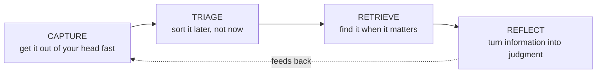
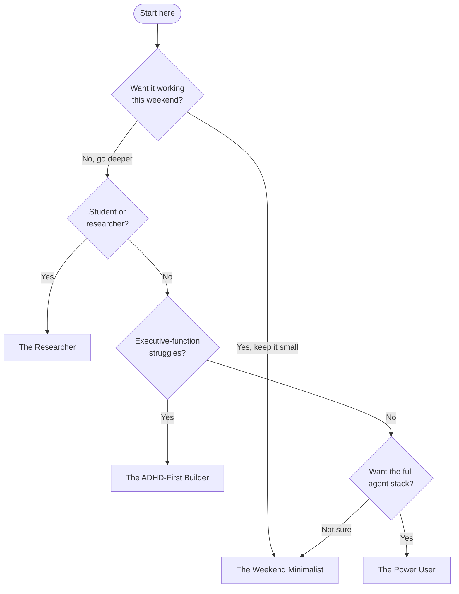

# The Guide — Start Here

> [!NOTE]
> This folder is your copy of the noesis-starter guide, installed by setup. It's a **generated artifact** — to update it, re-run setup (or re-copy `docs/` from the repo). Edits made here will be overwritten.

A second brain has four jobs. Every tool, folder, and automation in this guide exists to serve one of them:

If a tool doesn't make one of those four jobs *easier*, it's decoration. Cut it. → Full treatment in [01 — Foundations & Philosophy](01-foundations-and-philosophy.md).

---

## Where do *you* start?

> [!TIP]
> Not sure? Start as **The Weekend Minimalist**. Every other path is a superset of it.

## The paths

### 🟢 The Weekend Minimalist
1. [01 — Foundations & Philosophy](01-foundations-and-philosophy.md)
2. [02 — Obsidian Vault Setup](02-obsidian-vault-setup.md) — the **3-folder minimum** branch
3. *Stop here for the weekend.* Later: [05 — Skills & Automation](05-skills-and-automation.md).

### 🔵 The Researcher
1. [01 — Foundations & Philosophy](01-foundations-and-philosophy.md)
2. [02 — Obsidian Vault Setup](02-obsidian-vault-setup.md) — full taxonomy + MOCs
3. [03 — The Agent Layer (Claude Code)](03-the-agent-layer-claude-code.md)
4. [04 — Connectors & Tools (CLI → API → MCP)](04-connectors-and-tools.md)
5. [07 — Sync, Devices & Maintenance](07-sync-devices-and-maintenance.md)

### 🟣 The ADHD-First Builder
1. [01 — Foundations & Philosophy](01-foundations-and-philosophy.md) — the "externalized executive function" section
2. [06 — ADHD Empowerment System](06-adhd-empowerment-system.md) — **read this before the Obsidian doc.**
3. [02 — Obsidian Vault Setup](02-obsidian-vault-setup.md) — just the 3-folder minimum
4. [03 — The Agent Layer (Claude Code)](03-the-agent-layer-claude-code.md)
5. [05 — Skills & Automation](05-skills-and-automation.md)
6. Going further: [ADHD patterns](advanced/adhd-patterns.md)

### 🔴 The Power User / Tinkerer
Read **everything**, 01 → 08. Pay special attention to [04 — Connectors & Tools](04-connectors-and-tools.md) (the load-bearing doctrine), [07 — Sync, Devices & Maintenance](07-sync-devices-and-maintenance.md) (the canonical-device pattern), and [08 — Going Further](08-going-further-advanced.md) (local LLMs, mobile control, the CLI factory). Then the advanced layer:
[Typed memory](advanced/typed-memory.md) · [MCP wiring](advanced/mcp-wiring.md) · [Agent system](advanced/agent-system.md) · [ADHD patterns](advanced/adhd-patterns.md) · [Data pipelines](advanced/data-pipelines.md)

### Already have a vault?
Don't start from scratch — see [Augmenting an existing vault](augmenting-an-existing-vault.md) (Windows + macOS).

---

## Full index

| Doc | What it gives you |
|---|---|
| [01 — Foundations & Philosophy](01-foundations-and-philosophy.md) | Why second brains work; the four jobs; the three-layer voice model |
| [02 — Obsidian Vault Setup](02-obsidian-vault-setup.md) | Install, folder taxonomy, frontmatter, MOCs, plugins, periodic notes |
| [03 — The Agent Layer (Claude Code)](03-the-agent-layer-claude-code.md) | Install, the dual-CLAUDE.md pattern, settings, memory, context discipline |
| [04 — Connectors & Tools (CLI → API → MCP)](04-connectors-and-tools.md) | The integration doctrine + the CLI toolbelt |
| [05 — Skills & Automation](05-skills-and-automation.md) | Skills, slash commands, authoring your own, hooks, scheduling |
| [06 — ADHD Empowerment System](06-adhd-empowerment-system.md) | Executive-function scaffolding patterns |
| [07 — Sync, Devices & Maintenance](07-sync-devices-and-maintenance.md) | Multi-device parity, drift audits, backup, hygiene |
| [08 — Going Further (Advanced)](08-going-further-advanced.md) | Local LLMs, multi-provider, mobile, knowledge graph, CLI factory |

> [!NOTE]- Glossary (click to expand)
> - **Second brain** — a trusted external system that holds what your biological memory shouldn't have to.
> - **Vault** — Obsidian's name for a folder of Markdown files that *is* your knowledge base. Plain files, no lock-in.
> - **MOC (Map of Content)** — a hub note that links out to related notes; a hand-curated index. (You're reading one.)
> - **Agent layer** — an AI (here, Claude Code) that can read, write, and act on your vault and connected services.
> - **CLAUDE.md** — the instruction file that tells the agent who you are and how to behave.
> - **Skill** — a reusable, packaged workflow the agent can invoke (often via a `/slash-command`).
> - **MCP (Model Context Protocol)** — a standard for connecting an agent to external services.
> - **CLI** — a command-line tool. The *preferred* way to connect an agent to a service (cheaper and more reliable than MCP).
> - **Capture-fast-sort-slow** — drop everything into one inbox instantly; organize on your own schedule, never at capture time.
> - **Three-layer voice model** — *operational* (AI-assisted) / *journal* (raw, never AI-edited) / *reflection* (curated) kept separate so authorship is never ambiguous.
